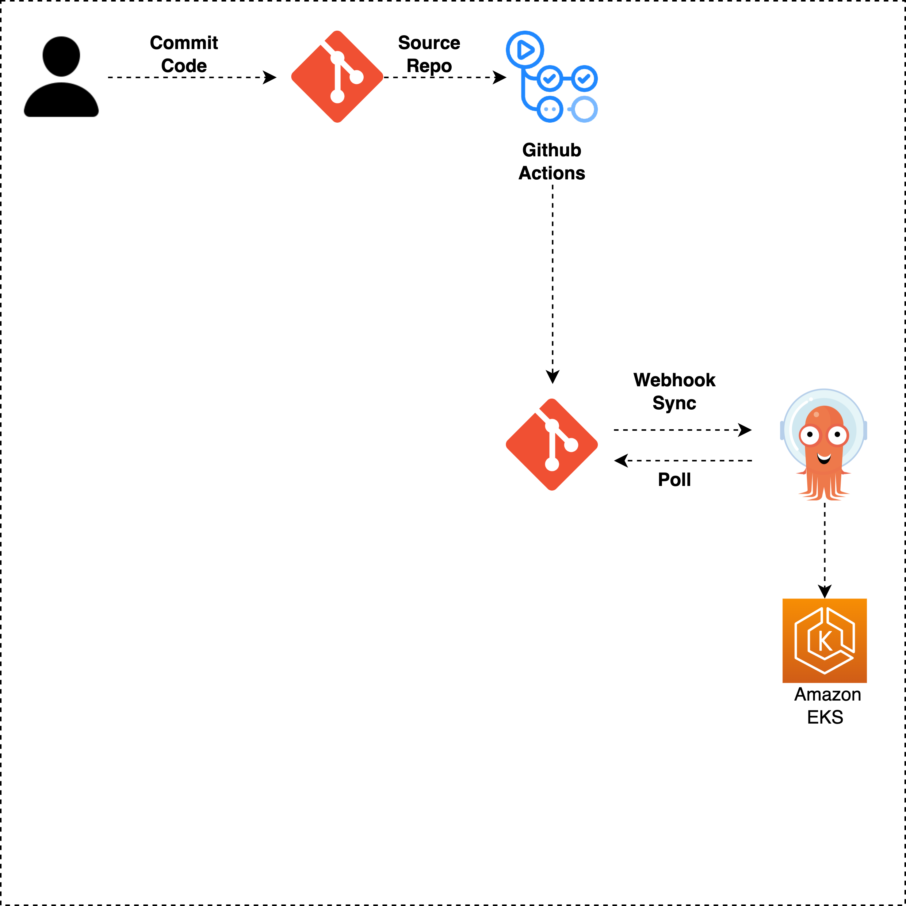

# argocd-setup
# Argo CD - Declarative Continuous Delivery for Kubernetes

## What is Argo CD?

Argo CD is a declarative, GitOps continuous delivery tool for Kubernetes.

## Why Argo CD?

1. Application definitions, configurations, and environments should be declarative and version controlled.
1. Application deployment and lifecycle management should be automated, auditable, and easy to understand.

## Who uses Argo CD?

[Official Argo CD user list](USERS.md)

## Documentation

To learn more about Argo CD [go to the complete documentation](https://argo-cd.readthedocs.io/).
Check live demo at https://youtu.be/aknJrQH8TMM.
